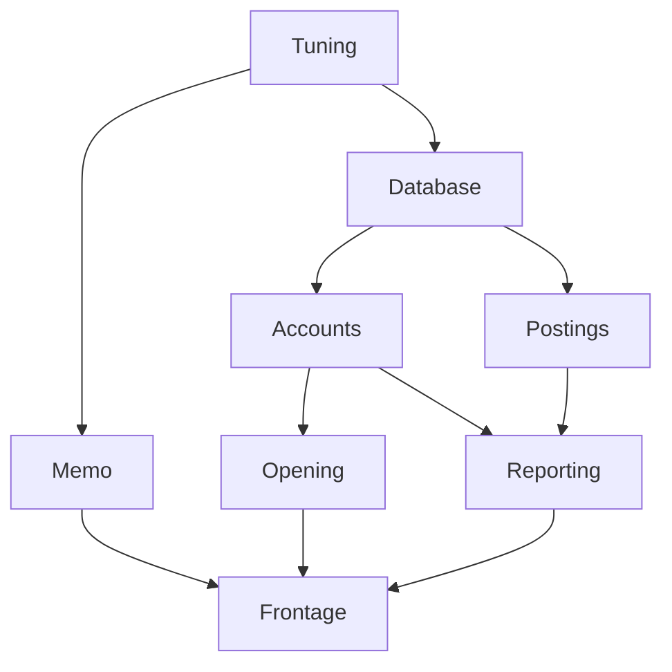

# Building an application

> Lark is a scratchpad, not a finished library — see
> [what this is](../README.md#what-this-is). Everything here works and is tested;
> none of it is settled.

Recipes for `lark-app`, in the order a service meets them. Every Kotlin fence
below is compiled by `CookbookTest` against the library it documents, so a
recipe that stops being true stops the build.

```kotlin
dependencies {
    implementation("io.github.matthewjones372:lark-app:0.1.0")
    implementation("io.github.matthewjones372:lark-app-pekko:0.1.0")  // actors only
}
```

The types the recipes are written against, once:

<!-- cookbook-fixtures -->
```kotlin
import arrow.core.getOrElse
import kotlin.system.exitProcess
import io.github.matthewjones372.lark.app.render
import io.github.matthewjones372.lark.LogLevel
import io.github.matthewjones372.lark.LogLine
import io.github.matthewjones372.lark.Logger
import io.github.matthewjones372.lark.logSpan
import io.github.matthewjones372.lark.logger
import org.slf4j.LoggerFactory
import io.github.matthewjones372.lark.capturingLogs
import io.github.matthewjones372.lark.capturingMetrics
import io.github.matthewjones372.lark.counter
import io.github.matthewjones372.lark.gauge
import io.github.matthewjones372.lark.increment
import io.github.matthewjones372.lark.metricTagged
import io.github.matthewjones372.lark.timed
import arrow.core.Either
import arrow.core.raise.either
import io.github.matthewjones372.lark.Bulkhead
import io.github.matthewjones372.lark.CircuitBreaker
import io.github.matthewjones372.lark.Schedule
import io.github.matthewjones372.lark.guarded
import io.github.matthewjones372.lark.policy
import io.github.matthewjones372.lark.clock
import io.github.matthewjones372.lark.fixedClock
import io.github.matthewjones372.lark.logAnnotated
import io.github.matthewjones372.lark.logInfo
import io.github.matthewjones372.lark.parMap
import io.github.matthewjones372.lark.app.pekko.actor
import org.apache.pekko.actor.ActorSystem
import org.apache.pekko.actor.typed.ActorRef
import org.apache.pekko.actor.typed.Behavior
import org.apache.pekko.actor.typed.javadsl.Behaviors
import io.github.matthewjones372.lark.ExitCase
import io.github.matthewjones372.lark.app.HealthRegistry
import io.github.matthewjones372.lark.app.RealSys
import io.github.matthewjones372.lark.app.Module
import io.github.matthewjones372.lark.app.Sys
import io.github.matthewjones372.lark.app.overriding
import io.github.matthewjones372.lark.app.probe
import io.github.matthewjones372.lark.app.runApp
import io.github.matthewjones372.lark.app.boundTo
import io.github.matthewjones372.lark.app.single
import io.github.matthewjones372.lark.app.singleOf
import io.github.matthewjones372.lark.app.subgraph
import io.github.matthewjones372.lark.app.testApp
import io.github.matthewjones372.lark.app.AppScope
import io.github.matthewjones372.lark.app.LarkApp
import io.github.matthewjones372.lark.app.findings
import io.github.matthewjones372.lark.app.report
import io.github.matthewjones372.lark.app.use
import io.github.matthewjones372.lark.app.validate
import kotlin.reflect.typeOf
import kotlin.time.Duration.Companion.milliseconds
import kotlin.time.Duration.Companion.seconds

data class DbConfig(val url: String)
data class HttpConfig(val port: Int)
data class AppConfig(val db: DbConfig, val http: HttpConfig)

interface Pool { fun healthy(): Boolean }
class Hikari(val config: DbConfig) : Pool {
    override fun healthy() = true
    fun close() = Unit
}

interface UserRepo { fun find(id: Long): String? }
class PgUserRepo(private val pool: Pool) : UserRepo {
    override fun find(id: Long) = "user-$id"
}

class RegisterUser(private val users: UserRepo)

class HttpServer(private val config: HttpConfig, private val register: RegisterUser) {
    fun start() = Unit
    fun stop() = Unit
}
```

## A constructor is a node

A constructor reference already declares what it builds and what it needs, so
`singleOf` reads both off it:

<!-- cookbook -->
```kotlin
class PgUsers(private val pool: Pool)

val fromConstructors: Module = singleOf(::Hikari).boundTo<Pool>() + singleOf(::PgUsers)
```

`boundTo` keys a node as the interface everything else asks for, which is also
what stops the type-argument trap below: with `singleOf` you never give a type
argument beside a dependency.

Most of a graph is not a bare constructor, though — it is a pool, a client or a
connection with a teardown called `close` or `dispose` or `shutdown`. That takes
the release beside the constructor:

<!-- cookbook -->
```kotlin
val heldThings: Module = singleOf(::Hikari, Hikari::close).boundTo<Pool>()
```

## What a `single` is

One node of the graph: how to build one value, and what it needs to build it.

<!-- cookbook -->
```kotlin
val aPool: Module = single { db: DbConfig -> Hikari(db) as Pool }
```

Three things are said there, all by the types:

- **the parameters are the dependencies.** This one needs a `DbConfig`, and the
  graph will not build it until something else has provided one.
- **the return type is the key.** This one provides a `Pool`. A node asking for
  a `Pool` gets this.
- **it is built once.** The name means one instance per application, not one per
  use: ten nodes asking for a `Pool` share the one this built.

Without the graph you would write the same thing by hand, and it works right up
until ordering, sharing, closing and testing matter:

```kotlin
val db = DbConfig("jdbc:…")
val pool = Hikari(db)              // who closes it, and when?
val users = PgUserRepo(pool)       // and if two things need a pool, is it this one?
```

`plus` puts nodes together, and the order you write them in means nothing —
matching is by type:

<!-- cookbook -->
```kotlin
val twoNodes: Module = single { db: DbConfig -> Hikari(db) as Pool } +
    single<UserRepo, Pool> { pool -> PgUserRepo(pool) }
```

### A factory that came from Java

A Java method hands back a *platform* type, so the key is inferred as `Tracer!`
and nothing asking for a `Tracer` ever matches it — the graph says `missing
Tracer` while a Tracer sits in it. Name the key with `boundTo`, not with a type
argument:

<!-- cookbook -->
```kotlin
val fromJava: Module = single { pool: Pool -> pool.toString() }.boundTo<CharSequence>()
```

A type argument would work too, and costs more than it looks: naming the key as
one forces the dependency to be one as well, because Kotlin has no partial
type-argument inference. `single<CharSequence, Pool> { … }` names `Pool` twice —
once as a type argument, once as the lambda's parameter. `boundTo` takes the key
afterwards, so each type is written once.

A node that needs nothing writes its type argument out, because a bare lambda
would also fit the one-dependency overload with the dependency as its `it`:

<!-- cookbook -->
```kotlin
val noDependencies: Module = single<Sys> { RealSys }
```

## Wire an application

A recipe names what it builds and takes what it needs as parameters. Nothing
runs while the graph is being described.

<!-- cookbook -->
```kotlin
val config: Module =
    single<Sys> { RealSys } +
    single { sys: Sys ->
        AppConfig(
            DbConfig(sys.env("DB_URL") ?: refuse("DB_URL is not set")),
            HttpConfig(sys.env("PORT")?.toIntOrNull() ?: refuse("PORT is not a number")),
        )
    } +
    single { app: AppConfig -> app.db } +
    single { app: AppConfig -> app.http }

val persistence: Module =
    single { db: DbConfig -> install({ Hikari(db) }) { pool, _ -> pool.close() } as Pool } +
    single<UserRepo, Pool> { pool -> PgUserRepo(pool) }

val domain: Module = single { users: UserRepo -> RegisterUser(users) }

val web: Module =
    single { http: HttpConfig, register: RegisterUser -> HttpServer(http, register) }

val app: Module = config + persistence + domain + web
```

Order means nothing — matching is by type. `plus` is override, so the
right-hand node wins wherever two share a key.

## Run it

<!-- cookbook -->
```kotlin
fun main() {
    exitProcess(
        runApp(app) { server: HttpServer ->
            server.start()
            awaitShutdown()
        }.code
    )
}
```

`runApp` answers with an `ExitCode` rather than ending the process, so a test
can run an application and read what it decided. The `exitProcess` is yours and
worth making: a stray non-daemon thread keeps a JVM alive after `main` returns.

Independent nodes start on forks of their own, the first refusal interrupts its
siblings, and everything acquired is released in reverse topological order. A
signal returns from `awaitShutdown`, and the JVM hook waits for the releases
before the process leaves.

## Configuration a module owns

`lark-app-typesafe` makes a HOCON section a node, read by the module that needs
it. Nothing is wrapped: `of` hands you the real `com.typesafe.config.Config`, so
substitution, merging, lists, `getDuration` and `getMemorySize` all still work.

```kotlin
dependencies {
    implementation("io.github.matthewjones372:lark-app-typesafe:0.1.0")
}
```

```kotlin
import com.typesafe.config.Config
import com.typesafe.config.ConfigFactory
import io.github.matthewjones372.lark.app.typesafe.config

data class DbSettings(val url: String, val poolSize: Int, val idle: kotlin.time.Duration)

val database: Module =
    single<Config> { ConfigFactory.load() } +
    config<DbSettings>("database") { DbSettings(string("url"), int("poolSize"), duration("idle")) } +
    single { db: DbSettings -> install({ Hikari(DbConfig(db.url)) }) { pool, _ -> pool.close() } as Pool }
```

`string`, `int`, `long`, `boolean`, `duration`, `bytes` and `strings` are the
readers; `of(default) { … }` hands you the real `Config` for anything else, so
`getMemorySize`, `getConfigList` and the rest are a line away rather than
walled off.

The module owns its section: one added later brings its own reading rather than
editing a root type that has to know about every section. What the integration
adds over Typesafe Config is that a failed read records its fault and the block
runs on, so a bad file is one message rather than one deploy per fault — in
Typesafe Config's own words, which name the file and the line.

### Where a setting came from

A hierarchy resolves to one document, and the question is always which file said
that and what it overrode:

```kotlin
import io.github.matthewjones372.lark.app.typesafe.layeredConfig
import io.github.matthewjones372.lark.app.typesafe.origins

layeredConfig().origins().report()
```

<!-- cookbook-config-report -->
```
lark-app configuration

petshop.arrivalsEvery  30s           reference.conf:4
petshop.db.password    ●●●●●●        application.conf:5
petshop.db.pool        16            application.conf:4
                       overrides 4 at reference.conf:3
petshop.port           9090          application.conf:2
                       overrides 8080 at reference.conf:2
```

`config.origins()` answers the same for a document already merged, minus the
override line: `withFallback` keeps the winner and forgets what it beat, so the
layers have to be held apart for that — the same thing `plus` does to a shadowed
node, answered the same way. `layeredConfig()` holds them.

**Values are redacted by default.** A name match — `password`, `token`, `key`
and the rest — is the floor, and it misses a secret that has no such name:

```kotlin
import io.github.matthewjones372.lark.app.typesafe.Secrets

config.origins(Secrets.default.and("petshop.db.url")).report()   // jdbc:…//user:pass@host
```

`Secrets` can be added to and not shrunk. For the value itself, `secret(path)`
reads one as a `Secret`, which prints as the mask through `toString` and gives
its value only to `reveal()` — so a log line and an exception cannot leak it
either:

```kotlin
import io.github.matthewjones372.lark.app.typesafe.Secret

data class Credentials(val url: Secret, val poolSize: Int)

config<Credentials>("database") { Credentials(secret("url"), int("poolSize")) }
```

Two things worth knowing about HOCON that the report is careful with. An
**environment variable is not a layer**: it enters only where a file wrote
`${?FOO}`, and setting one with no such substitution changes nothing. And
`ConfigFactory.defaultReference()` already carries system properties, so
`layeredConfig` parses the reference file itself rather than asking for it —
otherwise the report would say `reference.conf` holds a value that came from
`-D`.

### Configuration in a test

```kotlin
import io.github.matthewjones372.lark.app.typesafe.configFromResource
import io.github.matthewjones372.lark.app.typesafe.configOf
import io.github.matthewjones372.lark.app.typesafe.loadedConfig
import io.github.matthewjones372.lark.app.typesafe.overridingConfig

loadedConfig()                              // what the service reads: application.conf and its reference
configFromResource("test.conf")             // a file beside the test
configOf("database.poolSize = 1")           // a document written where the test is
```

Changing one key without restating the file is the case that matters:

```kotlin
testApp(app.overridingConfig("petshop.port = 0")) { server: PelicanServer -> server.baseUrl }
```

`overridingConfig` puts the document on top of what the service would have read,
so the port is a random one while the database, the broker and everything else
still come from `application.conf`. The `overriding` underneath refuses a key
nothing provides, so a typo is a failed test rather than a setting silently
ignored.

### A setting that picks a module

`useCache` does not configure a repository; it chooses between two. `config`
cannot answer that, because it makes the section a node and the choice has to be
made before any node is built — lark-app builds every node the graph holds, so a
branch left in one starts its resources too.

`choosing` reads the section where the graph is assembled, and hands it to a
block that picks:

```kotlin
import com.typesafe.config.Config
import com.typesafe.config.ConfigFactory
import io.github.matthewjones372.lark.app.typesafe.choosing
import io.github.matthewjones372.lark.app.typesafe.configOf

data class RepoSettings(val useCache: Boolean, val ttl: kotlin.time.Duration)

fun persistence(conf: Config): Module =
    conf.choosing("repo", { RepoSettings(boolean("useCache"), duration("ttl")) }) { repo ->
        if (repo.useCache) cachingRepo else plainRepo
    }

object Shop : LarkApp<Pool>() {
    override val module = ConfigFactory.load().let { conf -> configOf(conf) + persistence(conf) }
    override fun AppScope.run(root: Pool) = awaitShutdown()
}
```

The branch not taken contributes no node, nothing to build and nothing to start.
`RepoSettings` is still a node, so a recipe that wants `ttl` takes it as a
dependency rather than naming the path a second time, and a section that will
not read refuses the start there, naming every fault at once.

Two things follow from the choice being made at assembly rather than at start.
`checkWiring` runs on the main runtime classpath, so the graph it draws is the
one `application.conf` picks — a branch reached only through a deployment
override is not drawn. And `overridingConfig` cannot un-pick a choice already
made: a test flips it by assembling with its own `Config`, or by `overriding`
the node the branch provides.

Where the setting is already in hand, none of this is needed. `Module` is a
value, so `when` over it answers with one:

```kotlin
val carts: Module = when (settings.getString("cartStore")) {
    "postgres" -> postgresCarts
    else -> redisCarts
}
```

## Read the process itself

`Sys` is the process rather than a configuration library: what a node reads when
it wants `PATH` rather than a setting. A node calling `System.getenv` directly is
a node no test can configure.

<!-- cookbook -->
```kotlin
val fromTheProcess: Module =
    single<Sys> { RealSys } +
    single { sys: Sys -> DbConfig(sys.env("DB_URL") ?: refuse("DB_URL is not set")) }
```

`FakeSys(mapOf("DB_URL" to "jdbc:postgresql://db/app"))` replaces it in a test, with no
JVM-wide environment variable set anywhere.

## Something that has to be given back

<!-- cookbook -->
```kotlin
val closing: Module = single { db: DbConfig ->
    install({ Hikari(db) }) { pool, exit ->
        if (exit is ExitCase.Failure) pool.close() else pool.close()
    } as Pool
}
```

The release is told how the scope ended. Releases run in reverse **topological**
order, not reverse acquisition order — under `parMap` whichever fork won the
race is not an order to give anything back in.

## Two of the same type

One key, one instance. A second `Pool` needs a second key, and a value class is
free under type keys:

<!-- cookbook -->
```kotlin
@JvmInline
value class Replica(val pool: Pool)

val replicated: Module =
    single { db: DbConfig -> Hikari(db) as Pool } +
    single { db: DbConfig -> Replica(Hikari(DbConfig(db.url + "-replica"))) } +
    single { primary: Pool, replica: Replica -> PgUserRepo(replica.pool) as UserRepo }
```

The type says which one a consumer wanted, which a `named("replica")` string
would not.

## Bind an interface

The key is the recipe's return type. Kotlin has no partial type-argument
inference, so it is all the type arguments or none:

<!-- cookbook -->
```kotlin
val boundToInterface: Module = single<UserRepo, Pool> { pool -> PgUserRepo(pool) }

val boundToTheClass: Module = single { pool: Pool -> PgUserRepo(pool) }
```

The first is keyed `UserRepo`, the second `PgUserRepo`. Bind to the interface
when a test will swap it; otherwise the class is honest.

## Something slow to start

Dependents wait for the probe, not the recipe. A pool with no connection has
been constructed and can serve nothing.

<!-- cookbook -->
```kotlin
val probed: Module =
    single { db: DbConfig -> install({ Hikari(db) }) { pool, _ -> pool.close() } as Pool }
        .probe("db", timeout = 2.seconds, attempts = 10, interval = 500.milliseconds) { pool: Pool ->
            pool.healthy()
        }
```

Each probe is asked inside its own timeout, so a probe that hangs is not a start
that hangs. The wait between attempts goes through the bound clock — under
`fixedClock`, ten attempts take microseconds.

## Answer /ready and /live

The same probes answer afterwards. `HealthRegistry` is the one key a running
application provides itself, so a route takes it as a dependency:

<!-- cookbook -->
```kotlin
class Routes(private val health: HealthRegistry) {
    fun ready() = health.readiness()
    fun live() = health.liveness()
}

val routed: Module = probed + single { health: HealthRegistry -> Routes(health) }
```

`critical = false` on a probe degrades rather than downs. A node reading
`liveness()` on the way up is told the graph is still coming up.

## Test one thing, not everything

<!-- cookbook -->
```kotlin
class InMemoryUsers : UserRepo {
    override fun find(id: Long) = "fake-$id"
}

fun aTest() {
    val underTest = app.subgraph<RegisterUser>()
        .overriding(single<UserRepo> { InMemoryUsers() })

    testApp(underTest) { register: RegisterUser -> register }
}
```

`subgraph` keeps only what its root is reached through — four nodes, not forty.
`overriding` refuses a key the module does not already hold, because plain
`plus` would add a node nothing asked for and leave the real one running: a
green test that faked nothing. `testApp` releases whatever the block did, an
assertion failure included.

## Check the graph without running it

<!-- cookbook -->
```kotlin
fun theApplicationWires() = app.validate()

fun theWiringIsWhatWeThink(): String = app.render()
```

`validate` runs no recipe and names every missing key at once, with a cycle
given as the path around it.

`findings` asks that and two more, and answers with a list rather than a `Plan`:

<!-- cookbook -->
```kotlin
object TheApp : LarkApp<HttpServer>() {

    override val module: Module = app

    override fun AppScope.run(root: HttpServer) {
        root.start()
        awaitShutdown()
    }
}

fun everyFault(): String = TheApp.module.findings(TheApp.root).report()
```

```
lark-app wiring

❯ error: missing Pool
❯     for PgUserRepo         Wiring.kt:42

❯ warning: HttpConfig provided twice
❯     Config.kt:14           shadowed
❯     Local.kt:9             wins

❯ warning: nothing reaches Metrics          Telemetry.kt:9
```

A node remembers the file and line it was written on, so the report names the
recipe to edit rather than only the type it asked for. A missing key and a cycle
are errors; a key provided twice and a node no root reaches are warnings —
`plus` is override, so `overriding` is a duplicate on purpose and is not
reported, and a node held for its side effect alone is legal. Only the top of
each unreached subtree is named: a module left out of the graph is one edit, not
nine lines.

An application declared as a value carries the root the check measures
reachability from, which `runApp(TheApp)` also starts. Applying
`io.github.matthewjones372.lark.wiring` to the project runs all of this on every
`check` and draws each graph into `build/reports/lark` — see
[`docs/app.md`](app.md).

`render` draws mermaid in a stable order, so the drawing can live in review. For
this graph —

```kotlin
val drawn: Module =
    single<Tuning> { Tuning() } +
        single { _: Tuning -> Database() } +
        single { _: Tuning -> Memo() } +
        single { _: Database -> Accounts() } +
        single { _: Database -> Postings() } +
        single { _: Accounts -> Opening() } +
        single { _: Accounts, _: Postings -> Reporting() } +
        single { _: Memo, _: Opening, _: Reporting -> Frontage() }
```

— `drawn.render()` answers exactly this, which GitHub renders as the picture
([and as a PNG](wiring.png), for a viewer that does not draw mermaid):

<!-- cookbook-diagram -->


Two things a reader gets from it that the code does not show: `Database` and
`Memo` have no edge between them, so they start at the same time; and every
path into `Frontage` is a thing that must be ready before the door opens.

The PNG is made by `docs/render-diagram.sh`, and `DiagramImageTest` holds it to
the fence: a graph that moves without the picture moving fails the build.

`WiringDiagramTest` holds the fence above to what `render` actually answers. A
drawing of a graph is worth having in review only while it is the graph.

## Write a log line

`logInfo` and its three siblings write to whichever `Logger` the current thread
has bound. No node takes a logger, and none has to:

<!-- cookbook -->
```kotlin
class Registering(private val users: UserRepo) {
    fun register(id: Long): String {
        logInfo("registering $id")
        return users.find(id) ?: "created"
    }
}
```

Out of the box that reaches stderr, which is enough to watch a service start.

## Send the log somewhere real

Put `lark-slf4j` on the classpath. There is no second step: the module registers
itself, so every line the application writes — every node's recipe, every fork of
a `parMap` — goes to the backend the rest of the service already logs through.

```kotlin
dependencies {
    implementation("io.github.matthewjones372:lark-slf4j:0.2.0")
}
```

An annotation goes to the MDC, so `%X{correlation_id}` and a JSON encoder read
it. Appending it to the message, which is what a hand-rolled adapter usually
does, leaves every field search with nothing.

To write your own instead — a different backend, or a different shape of line —
bind it once around `runApp`, and that binding wins over anything the classpath
registered:

<!-- cookbook -->
```kotlin
class Slf4jLogger : Logger {
    private val log = LoggerFactory.getLogger("app")

    override fun log(line: LogLine) {
        val annotated = line.annotations.entries.joinToString(" ") { (key, value) -> "$key=$value" }
        val message = if (annotated.isEmpty()) line.message else "${line.message} $annotated"
        when (line.level) {
            LogLevel.Debug -> log.debug(message)
            LogLevel.Info -> log.info(message)
            LogLevel.Warn -> log.warn(message)
            LogLevel.Error -> log.error(message, line.cause)
        }
    }
}

fun mainWithLogging() {
    val exit = logger.locally(Slf4jLogger()) {
        runApp(app) { server: HttpServer ->
            server.start()
            awaitShutdown()
        }
    }
    exitProcess(exit.code)
}
```

`lark` has no logging dependency and never will; the adapter is yours, and it is
the twenty lines above.

## Say which request a line belongs to

An annotation is bound for a block, and every line written inside it carries it
— including lines written on a fork, which is what an MDC cannot do:

<!-- cookbook -->
```kotlin
fun handling(id: String, items: List<Int>): List<Unit> =
    logAnnotated("correlation_id" to id) {
        logSpan("register") {
            parMap(items) { item -> logInfo("checking $item") }
        }
    }
```

Each line carries `correlation_id=…` and `register_ms=…`, the second being how
long the span had been running when the line was written. Spans nest, and each
is keyed by its own name.

## Assert on what was logged

<!-- cookbook -->
```kotlin
fun aLoggingTest(): List<LogLine> = capturingLogs { logs ->
    logAnnotated("correlation_id" to "abc-123") { logInfo("registered") }
    logs.all()
}
```

`capturingLogs` binds a logger the test can read, so a claim about logging is a
claim about values rather than about a backend.

## Count something

No node takes a registry, and nothing is declared up front. A meter is looked up
by name, which every backend does with a map:

<!-- cookbook -->
```kotlin
class Adopting(private val pets: MutableList<String>) {
    fun adopt(name: String): String = timed("petshop.adopt") {
        counter("petshop.adoptions").increment()
        gauge("petshop.queue.depth").set(pets.size.toDouble())
        name
    }
}
```

`timed` records how long the block took, in milliseconds, and answers what the
block answered. It records in a `finally`, so a call that failed slowly is still
counted — leaving it out makes the numbers say the opposite of what happened.

## Say which series a number belongs to

<!-- cookbook -->
```kotlin
fun adoptingATortoise(): Unit = metricTagged("species" to "tortoise") {
    counter("petshop.adoptions").increment()
}
```

A tag bound for a block is on every measurement taken inside it, including on a
fork, which is the same binding a log annotation rides.

It is **not** the same source. `logAnnotated("correlation_id" to id)` is written
to be unique, and a tag whose values are unbounded is one time series per
request — which is how a metrics backend dies. A tag's values are few and known
before the code runs.

## Send the numbers somewhere real

Put `lark-micrometer` on the classpath. There is no second step: it registers
itself, and the measurements reach whatever registry the service already has —
Prometheus, Datadog, StatsD, OTLP.

```kotlin
dependencies {
    implementation("io.github.matthewjones372:lark-micrometer:0.3.0")
}
```

It takes Micrometer's global registry unless it is handed one, since that is
where a service on Spring or on the OpenTelemetry bridge has already put theirs.
With nothing on the classpath a measurement is recorded nowhere, which costs
nothing and throws nothing.

## Assert on what was measured

<!-- cookbook -->
```kotlin
fun aMeteredTest(): Double = capturingMetrics { measured ->
    counter("petshop.adoptions").increment()
    measured.counter("petshop.adoptions")
}
```

## Control time

<!-- cookbook -->
```kotlin
fun aTimedTest(): List<LogLine> = clock.locally(fixedClock()) {
    capturingLogs { logs ->
        parMap(listOf(1, 2, 3)) { logInfo("branch $it") }
        logs.all()
    }
}
```

Under `fixedClock` nothing waits: a five-retry exponential backoff finishes in
microseconds, and every line is stamped with the same instant. `TestClock` is
the other one — it moves only when a test moves it, and `adjustWhenBlocked`
waits until every sleep is on a time still ahead before moving.

## Guard a call to something unreliable

<!-- cookbook -->
```kotlin
class Quotes(private val fetch: (String) -> Double) {
    private val partner = policy("partner-api") {
        deadline(2.seconds)
        retry(Schedule.exponential<Throwable>(100.milliseconds).jittered() zipLeft Schedule.recurs(3))
        attemptTimeout(500.milliseconds)
    }

    fun quote(id: String): Double = partner { fetch(id) }

    fun quoted(id: String): Either<String, Double> = either {
        guarded(partner, ifRejected = { "${it.guard} refused: ${it.message}" }) { fetch(id) }
    }
}
```

A policy is a value, checked when it is built: steps out of the order
deadline → retry → breaker → limiter → bulkhead → attemptTimeout throw there, not on the first call. The
`deadline` is one budget for the call, retries included. Retry stops before a
delay the budget cannot cover, and each attempt is cut to the shorter of its own
timeout and what is left.

Every call counts once in `lark.policy.calls`, tagged with the `policy`, an
`outcome` of `success`, `failure` or `rejected`, and `refused_by`: `deadline`,
or the guard that refused, or `none`. A `raise` is the call's own answer, so it
passes through every step and is not counted.

## Stop calling something that is down

<!-- cookbook -->
```kotlin
class Accounts(private val query: (String) -> String) {
    private val breaker = CircuitBreaker(
        name = "accounts-db",
        maxFailures = 5,
        resetAfter = Schedule.exponential<Unit>(1.seconds).jittered(0.8, 1.2) zipLeft Schedule.recurs(6),
    )

    private val db = policy("accounts-db") {
        guard(breaker)
        attemptTimeout(2.seconds)
    }

    fun row(id: String): String = db { query(id) }
}
```

After `maxFailures` failures in a row the breaker opens, and every call is
refused with `Rejected.CircuitOpen` without being made. Once the next delay of
`resetAfter` has passed, one trial goes through. If it answers, the breaker
closes and the schedule starts again; if it fails, the breaker reopens on the
schedule's next delay. A timeout inside the breaker counts as a failure, and a
`raise` never does. With a `deadline` in the policy, a refused call waits for
the trial when the deadline covers the wait.

`lark.breaker.state` is a gauge per breaker `name`: 0 closed, 1 half-open,
2 open. `lark.breaker.calls` counts its calls by `outcome`: `success`,
`failure` or `rejected`.

## Cap the calls to something slow

<!-- cookbook -->
```kotlin
class Partner(private val call: (String) -> String) {
    private val bulkhead = Bulkhead(name = "partner-api", maxConcurrent = 20, maxWait = 50.milliseconds)

    private val partner = policy("partner-api") {
        deadline(2.seconds)
        guard(bulkhead)
    }

    fun quote(id: String): String = partner { call(id) }
}
```

At most `maxConcurrent` callers are inside at once, let in in the order they
arrived. The rest wait up to `maxWait`, cut to what the `deadline` leaves, and
are refused with `Rejected.BulkheadFull` after. Virtual threads make a caller
cheap, so the bulkhead is what keeps five thousand of them off a pool of twenty
connections. The permit is given back however the call ends.

`lark.bulkhead.in_use` is a gauge per bulkhead `name` of the permits taken, and
`lark.bulkhead.calls` counts its calls by `outcome`: `admitted` or `rejected`.

## Run migrations as a step

`lark-app-liquibase` makes a changelog a node. Anything that reads the database
takes a `Migrated`, which turns "after the migrations" from a comment into an
edge the graph enforces and `render()` draws:

```kotlin
dependencies {
    implementation("io.github.matthewjones372:lark-app-liquibase:0.1.0")
}
```

```kotlin
import io.github.matthewjones372.lark.app.liquibase.Migrated
import io.github.matthewjones372.lark.app.liquibase.migrations

val database: Module =
    single { cfg: DbConfig -> install({ Hikari(cfg) }) { pool, _ -> pool.close() } as DataSource } +
    migrations("db/changelog.xml") +
    single { db: DataSource, _: Migrated -> PgUserRepo(db) as UserRepo }
```

`PgUserRepo` cannot be built before the changelog has run, and nothing had to
remember that. The connection the migration used is given back before the node
answers, so it is not a pool slot held for the life of the process.

`Migrated.applied` is how many changesets ran, which is the log line worth
having on a deploy.

## Trace across a fork

`lark-otel` puts OpenTelemetry's `Context` in a `LarkLocal` and registers it
through `META-INF/services`, so a span opened before a `parMap` is the parent of
what each branch opens — which a `ThreadLocal`, and so OpenTelemetry's own
storage, cannot be. Nothing in your code changes; the module being on the
classpath is the change.

```kotlin
dependencies {
    implementation("io.github.matthewjones372:lark-otel:0.1.0")
}
```

```kotlin
import io.github.matthewjones372.lark.otel.span
import io.github.matthewjones372.lark.otel.tracedSpan

fun pricing(tracer: Tracer, orders: List<Order>): List<Price> =
    tracer.span("price-all") {
        parMap(orders) { order -> tracer.span("price") { price(order) } }
    }
```

`tracedSpan` is the same thing with the ids on every log line written inside it,
so a line found in a log says which trace to open and a trace says which lines
to read:

```kotlin
tracer.tracedSpan("register") { logInfo("started") }   // trace_id=… span_id=…
```

The registration is process-wide: with the module on the classpath, every
library using OpenTelemetry's context in the JVM reads and writes it here,
whether or not it has heard of lark. That is the point — an HTTP client's span
has to be the same span a forked handler continues — and it is why this is a
module you opt into rather than anything in `lark`.

## Spawn an actor

<!-- cookbook-pekko -->
```kotlin
data class Ingest(val line: String)

fun ingesting(users: UserRepo): Behavior<Ingest> =
    Behaviors.receive(Ingest::class.java)
        .onMessage(Ingest::class.java) { Behaviors.same() }
        .build()

val actors: Module =
    single<ActorSystem> { install({ ActorSystem.create("app") }) { system, _ -> system.terminate() } } +
    single { pool: Pool -> PgUserRepo(pool) as UserRepo } +
    actor("ingest") { users: UserRepo -> ingesting(users) }

val sending: Module = single { ingest: ActorRef<Ingest> -> Routes2(ingest) }

class Routes2(private val ingest: ActorRef<Ingest>) {
    fun accept(line: String) = ingest.tell(Ingest(line))
}
```

The protocol is inferred from the behaviour's own type. Write it out —
`actor<Ingest>(…)` — only where the actor takes no dependencies, because with
one type argument given, the overload that takes a dependency cannot apply.

Asking one, and the reason the answer is bound to `Any`:

```kotlin
import io.github.matthewjones372.lark.app.pekko.ask

fun find(ref: ActorRef<Shop>, system: ActorSystem, id: PetId): Option<Pet> =
    ref.ask(system, 3.seconds) { replyTo -> Find(id, replyTo) }
```

Pekko refuses a null message, so an actor answering "there is no such thing"
with `null` throws where it meant to answer — and `ActorRef<Pet?>` compiles, so
neither Kotlin nor a typed protocol stops you writing it. `ask`'s reply is bound
to `Any`, which does: absence has to be modelled, as an `Option`, a sealed
reply, or an empty list. A `DoesNotCompileTest` fixture holds that.

An actor is keyed by the `ActorRef<T>` of its protocol, so two protocols are two
keys and a dependent declares what it sends. The stop is awaited through
`gracefulStop`, so an actor has given back what it held before the node that
opened it is released.

## What to reach for

| Want | Recipe |
|---|---|
| a value built once and shared | `singleOf(::Thing)` — the constructor names the key and the dependencies |
| that node keyed as an interface | `.boundTo<Interface>()` |
| a recipe that is not just a constructor | `single { dep: Other -> … }` |
| a value that must be closed | `install(acquire) { held, exit -> … }` |
| a start that can decline | `refuse("why")` |
| two of one type | a `@JvmInline value class` wrapper |
| more than nine dependencies | group them into a node of their own |
| readiness | `.probe(name, timeout, attempts, interval) { … }` |
| a fake in a test | `.overriding(single<T> { … })`, never plain `plus` |
| a smaller test | `.subgraph<Root>()` |
| no waiting in a test | `clock.locally(fixedClock()) { … }` |
| a call to something unreliable | `policy("…") { deadline(…); retry(…); attemptTimeout(…) }` |
| to stop calling something that is down | `guard(CircuitBreaker("…", maxFailures, resetAfter))` in a policy |
| to cap the calls to something slow | `guard(Bulkhead("…", maxConcurrent, maxWait))` in a policy |
| a log line | `logInfo("…")` — no node takes a logger |
| that log somewhere real | put `lark-slf4j` on the classpath; nothing else |
| a backend of your own | `logger.locally(MyLogger()) { runApp(…) }`, which wins over the classpath |
| which request a line belongs to | `logAnnotated("correlation_id" to id) { … }` |
| what a test logged | `capturingLogs { logs -> … ; logs.all() }` |
| to count something | `counter("…").increment()` — no node takes a registry |
| how long something took | `timed("…") { … }`, which answers what the block did |
| those numbers somewhere real | put `lark-micrometer` on the classpath; nothing else |
| which series a number belongs to | `metricTagged("species" to "tortoise") { … }` |
| what a test measured | `capturingMetrics { measured -> … }` |
| a trace that survives a fork | put `lark-otel` on the classpath; nothing else |
| migrations before anything reads | `migrations("db/changelog.xml")`, then take a `Migrated` |
| the wiring in review | `render()` against a golden file |
