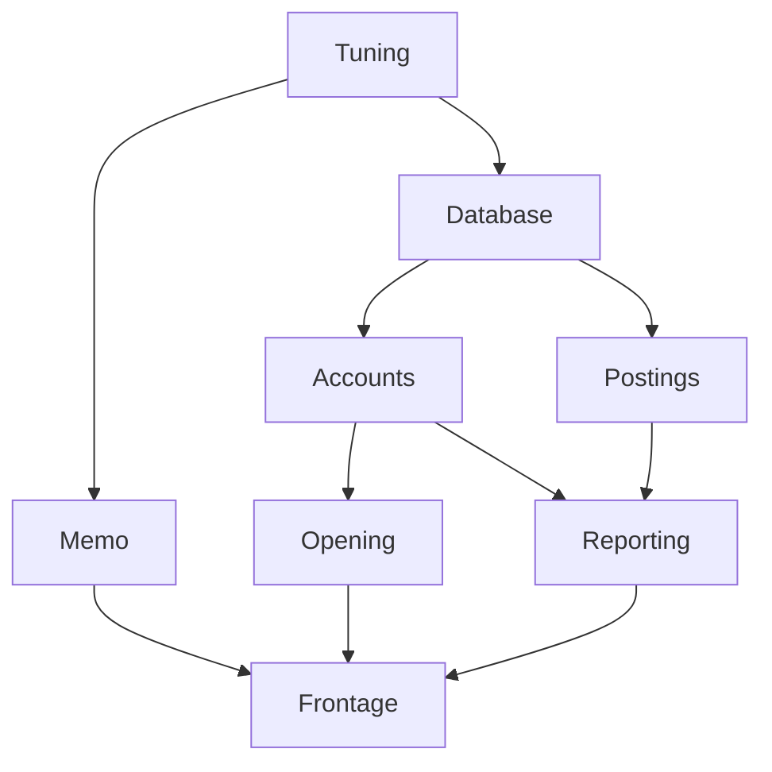

# Building an application

Recipes for `lark-app`, in the order a service meets them. Every Kotlin fence
below is compiled by `CookbookTest` against the library it documents, so a
recipe that stops being true stops the build.

```kotlin
dependencies {
    implementation("io.github.matthewjones372:lark-app:0.1.0-SNAPSHOT")
    implementation("io.github.matthewjones372:lark-app-pekko:0.1.0-SNAPSHOT")  // actors only
}
```

The types the recipes are written against, once:

<!-- cookbook-fixtures -->
```kotlin
import arrow.core.getOrElse
import io.github.matthewjones372.lark.app.Config
import io.github.matthewjones372.lark.app.asConfig
import io.github.matthewjones372.lark.app.choose
import io.github.matthewjones372.lark.app.configOf
import io.github.matthewjones372.lark.app.configured
import io.github.matthewjones372.lark.app.orElse
import io.github.matthewjones372.lark.LogLevel
import io.github.matthewjones372.lark.LogLine
import io.github.matthewjones372.lark.Logger
import io.github.matthewjones372.lark.logSpan
import io.github.matthewjones372.lark.logger
import org.slf4j.LoggerFactory
import io.github.matthewjones372.lark.capturingLogs
import io.github.matthewjones372.lark.clock
import io.github.matthewjones372.lark.fixedClock
import io.github.matthewjones372.lark.logAnnotated
import io.github.matthewjones372.lark.logInfo
import io.github.matthewjones372.lark.parMap
import io.github.matthewjones372.lark.app.pekko.actor
import org.apache.pekko.actor.ActorSystem
import org.apache.pekko.actor.typed.ActorRef
import org.apache.pekko.actor.typed.Behavior
import org.apache.pekko.actor.typed.javadsl.Behaviors
import io.github.matthewjones372.lark.ExitCase
import io.github.matthewjones372.lark.app.HealthRegistry
import io.github.matthewjones372.lark.app.RealSys
import io.github.matthewjones372.lark.app.Module
import io.github.matthewjones372.lark.app.Sys
import io.github.matthewjones372.lark.app.int
import io.github.matthewjones372.lark.app.overriding
import io.github.matthewjones372.lark.app.probe
import io.github.matthewjones372.lark.app.required
import io.github.matthewjones372.lark.app.runApp
import io.github.matthewjones372.lark.app.single
import io.github.matthewjones372.lark.app.subgraph
import io.github.matthewjones372.lark.app.testApp
import io.github.matthewjones372.lark.app.use
import io.github.matthewjones372.lark.app.validate
import kotlin.time.Duration.Companion.milliseconds
import kotlin.time.Duration.Companion.seconds

data class DbConfig(val url: String)
data class HttpConfig(val port: Int)
data class AppConfig(val db: DbConfig, val http: HttpConfig)

interface Pool { fun healthy(): Boolean }
class Hikari(val config: DbConfig) : Pool {
    override fun healthy() = true
    fun close() = Unit
}

interface UserRepo { fun find(id: Long): String? }
class PgUserRepo(private val pool: Pool) : UserRepo {
    override fun find(id: Long) = "user-$id"
}

class RegisterUser(private val users: UserRepo)

class HttpServer(private val config: HttpConfig, private val register: RegisterUser) {
    fun start() = Unit
    fun stop() = Unit
}
```

## What a `single` is

One node of the graph: how to build one value, and what it needs to build it.

<!-- cookbook -->
```kotlin
val aPool: Module = single { db: DbConfig -> Hikari(db) as Pool }
```

Three things are said there, all by the types:

- **the parameters are the dependencies.** This one needs a `DbConfig`, and the
  graph will not build it until something else has provided one.
- **the return type is the key.** This one provides a `Pool`. A node asking for
  a `Pool` gets this.
- **it is built once.** The name means one instance per application, not one per
  use: ten nodes asking for a `Pool` share the one this built.

Without the graph you would write the same thing by hand, and it works right up
until ordering, sharing, closing and testing matter:

```kotlin
val db = DbConfig("jdbc:…")
val pool = Hikari(db)              // who closes it, and when?
val users = PgUserRepo(pool)       // and if two things need a pool, is it this one?
```

`plus` puts nodes together, and the order you write them in means nothing —
matching is by type:

<!-- cookbook -->
```kotlin
val twoNodes: Module = single { db: DbConfig -> Hikari(db) as Pool } +
    single<UserRepo, Pool> { pool -> PgUserRepo(pool) }
```

A node that needs nothing writes its type argument out, because a bare lambda
would also fit the one-dependency overload with the dependency as its `it`:

<!-- cookbook -->
```kotlin
val noDependencies: Module = single<Sys> { RealSys }
```

## Wire an application

A recipe names what it builds and takes what it needs as parameters. Nothing
runs while the graph is being described.

<!-- cookbook -->
```kotlin
val config: Module =
    single<Sys> { RealSys } +
    single { sys: Sys ->
        AppConfig(
            DbConfig(sys.required("DB_URL").getOrElse { refuse("DB_URL is not set") }),
            HttpConfig(sys.int("PORT").getOrElse { refuse("PORT: $it") }),
        )
    } +
    single { app: AppConfig -> app.db } +
    single { app: AppConfig -> app.http }

val persistence: Module =
    single { db: DbConfig -> install({ Hikari(db) }) { pool, _ -> pool.close() } as Pool } +
    single<UserRepo, Pool> { pool -> PgUserRepo(pool) }

val domain: Module = single { users: UserRepo -> RegisterUser(users) }

val web: Module =
    single { http: HttpConfig, register: RegisterUser -> HttpServer(http, register) }

val app: Module = config + persistence + domain + web
```

Order means nothing — matching is by type. `plus` is override, so the
right-hand node wins wherever two share a key.

## Run it

<!-- cookbook -->
```kotlin
fun main(): Nothing = runApp(app) { server: HttpServer ->
    server.start()
    awaitShutdown()
}
```

Independent nodes start on forks of their own, the first refusal interrupts its
siblings, and everything acquired is released in reverse topological order. A
signal returns from `awaitShutdown`, and the JVM hook waits for the releases
before the process leaves.

## Configuration a module owns

`Config` is a facade with one method, the way `Logger` is: a dotted path in, a
string or nothing out. Where those strings come from — the environment, a YAML
tree, Hoplite, Typesafe Config — is an implementation, and none of them is in
this module.

<!-- cookbook -->
```kotlin
val settings: Config = RealSys.asConfig().orElse(configOf("http.port" to "8080"))
```

A section is a **node**, read by the module that needs it, so a module added
later brings its own configuration with it and nothing else names its paths:

<!-- cookbook -->
```kotlin
data class DbSettings(val url: String, val poolSize: Int, val ssl: Boolean)

val database: Module =
    configured("database") { DbSettings(string("url"), int("poolSize"), optional("ssl", false) { boolean(it) }) } +
    single { db: DbSettings -> install({ Hikari(DbConfig(db.url)) }) { pool, _ -> pool.close() } as Pool }
```

The type is the safety: `DbSettings` is built by code the compiler checks. A
read that cannot answer records why and the block runs on, so a bad deploy is
one message naming every fault rather than one deploy per fault:

```
lark-app: DbSettings refused to start: database.url is not set;
database.poolSize is not an Int: lots
```

## Choose a module from a setting

The `when` a service writes over its own settings — a Redis cart store or a
Postgres one, a broker or a simulator — is a value:

<!-- cookbook -->
```kotlin
fun carts(settings: Config): Module =
    settings.choose(
        "cartStore",
        default = "redis",
        "redis" to single<Pool> { Hikari(DbConfig("redis")) },
        "postgres" to single<Pool> { Hikari(DbConfig("postgres")) },
    )
```

The choice is made while the graph is being described, so the branch not taken
contributes no node, nothing to build and nothing to start — a service on
Postgres never opens a Redis connection, and `render()` draws only the shape
that deployment actually has. A value naming no branch is refused there and
then, saying what it was and what it could have been.

## Read configuration, and fail loudly

A node calling `System.getenv` is a node no test can configure. Take a `Sys`.

<!-- cookbook -->
```kotlin
val readingConfig: Module = single { sys: Sys ->
    AppConfig(
        db = DbConfig(sys.required("DB_URL").getOrElse { refuse("DB_URL is not set") }),
        http = HttpConfig(sys.int("PORT").getOrElse { refuse("PORT: $it") }),
    )
}
```

`refuse` ends the start naming this node, which is what reaches stderr through
`describe()`. `sys.int("PORT")` answers `ConfigError.NotA("PORT", "an Int",
"eighty-eighty")` rather than throwing, so several names can be read and every
complaint reported at once.

## Something that has to be given back

<!-- cookbook -->
```kotlin
val closing: Module = single { db: DbConfig ->
    install({ Hikari(db) }) { pool, exit ->
        if (exit is ExitCase.Failure) pool.close() else pool.close()
    } as Pool
}
```

The release is told how the scope ended. Releases run in reverse **topological**
order, not reverse acquisition order — under `parMap` whichever fork won the
race is not an order to give anything back in.

## Two of the same type

One key, one instance. A second `Pool` needs a second key, and a value class is
free under type keys:

<!-- cookbook -->
```kotlin
@JvmInline
value class Replica(val pool: Pool)

val replicated: Module =
    single { db: DbConfig -> Hikari(db) as Pool } +
    single { db: DbConfig -> Replica(Hikari(DbConfig(db.url + "-replica"))) } +
    single { primary: Pool, replica: Replica -> PgUserRepo(replica.pool) as UserRepo }
```

The type says which one a consumer wanted, which a `named("replica")` string
would not.

## Bind an interface

The key is the recipe's return type. Kotlin has no partial type-argument
inference, so it is all the type arguments or none:

<!-- cookbook -->
```kotlin
val boundToInterface: Module = single<UserRepo, Pool> { pool -> PgUserRepo(pool) }

val boundToTheClass: Module = single { pool: Pool -> PgUserRepo(pool) }
```

The first is keyed `UserRepo`, the second `PgUserRepo`. Bind to the interface
when a test will swap it; otherwise the class is honest.

## Something slow to start

Dependents wait for the probe, not the recipe. A pool with no connection has
been constructed and can serve nothing.

<!-- cookbook -->
```kotlin
val probed: Module =
    single { db: DbConfig -> install({ Hikari(db) }) { pool, _ -> pool.close() } as Pool }
        .probe("db", timeout = 2.seconds, attempts = 10, interval = 500.milliseconds) { pool: Pool ->
            pool.healthy()
        }
```

Each probe is asked inside its own timeout, so a probe that hangs is not a start
that hangs. The wait between attempts goes through the bound clock — under
`fixedClock`, ten attempts take microseconds.

## Answer /ready and /live

The same probes answer afterwards. `HealthRegistry` is the one key a running
application provides itself, so a route takes it as a dependency:

<!-- cookbook -->
```kotlin
class Routes(private val health: HealthRegistry) {
    fun ready() = health.readiness()
    fun live() = health.liveness()
}

val routed: Module = probed + single { health: HealthRegistry -> Routes(health) }
```

`critical = false` on a probe degrades rather than downs. A node reading
`liveness()` on the way up is told the graph is still coming up.

## Test one thing, not everything

<!-- cookbook -->
```kotlin
class InMemoryUsers : UserRepo {
    override fun find(id: Long) = "fake-$id"
}

fun aTest() {
    val underTest = app.subgraph<RegisterUser>()
        .overriding(single<UserRepo> { InMemoryUsers() })

    testApp(underTest) { register: RegisterUser -> register }
}
```

`subgraph` keeps only what its root is reached through — four nodes, not forty.
`overriding` refuses a key the module does not already hold, because plain
`plus` would add a node nothing asked for and leave the real one running: a
green test that faked nothing. `testApp` releases whatever the block did, an
assertion failure included.

## Check the graph without running it

<!-- cookbook -->
```kotlin
fun theApplicationWires() = app.validate()

fun theWiringIsWhatWeThink(): String = app.render()
```

`validate` runs no recipe and names every missing key at once, with a cycle
given as the path around it.

`render` draws mermaid in a stable order, so the drawing can live in review. For
this graph —

```kotlin
val drawn: Module =
    single<Tuning> { Tuning() } +
        single { _: Tuning -> Database() } +
        single { _: Tuning -> Memo() } +
        single { _: Database -> Accounts() } +
        single { _: Database -> Postings() } +
        single { _: Accounts -> Opening() } +
        single { _: Accounts, _: Postings -> Reporting() } +
        single { _: Memo, _: Opening, _: Reporting -> Frontage() }
```

— `drawn.render()` answers exactly this, which GitHub renders as the picture:

<!-- cookbook-diagram -->


Two things a reader gets from it that the code does not show: `Database` and
`Memo` have no edge between them, so they start at the same time; and every
path into `Frontage` is a thing that must be ready before the door opens.

`WiringDiagramTest` holds the fence above to what `render` actually answers. A
drawing of a graph is worth having in review only while it is the graph.

## Write a log line

`logInfo` and its three siblings write to whichever `Logger` the current thread
has bound. No node takes a logger, and none has to:

<!-- cookbook -->
```kotlin
class Registering(private val users: UserRepo) {
    fun register(id: Long): String {
        logInfo("registering $id")
        return users.find(id) ?: "created"
    }
}
```

Out of the box that reaches stderr, which is enough to watch a service start.

## Send the log somewhere real

Bind a backend once, around `runApp`. Everything the application then does —
every node's recipe, every fork of a `parMap` — is inside that binding:

<!-- cookbook -->
```kotlin
class Slf4jLogger : Logger {
    private val log = LoggerFactory.getLogger("app")

    override fun log(line: LogLine) {
        val annotated = line.annotations.entries.joinToString(" ") { (key, value) -> "$key=$value" }
        val message = if (annotated.isEmpty()) line.message else "${line.message} $annotated"
        when (line.level) {
            LogLevel.Debug -> log.debug(message)
            LogLevel.Info -> log.info(message)
            LogLevel.Warn -> log.warn(message)
            LogLevel.Error -> log.error(message, line.cause)
        }
    }
}

fun mainWithLogging(): Nothing = logger.locally(Slf4jLogger()) {
    runApp(app) { server: HttpServer ->
        server.start()
        awaitShutdown()
    }
}
```

`lark` has no logging dependency and never will; the adapter is yours, and it is
the twenty lines above.

## Say which request a line belongs to

An annotation is bound for a block, and every line written inside it carries it
— including lines written on a fork, which is what an MDC cannot do:

<!-- cookbook -->
```kotlin
fun handling(id: String, items: List<Int>): List<Unit> =
    logAnnotated("correlation_id" to id) {
        logSpan("register") {
            parMap(items) { item -> logInfo("checking $item") }
        }
    }
```

Each line carries `correlation_id=…` and `register_ms=…`, the second being how
long the span had been running when the line was written. Spans nest, and each
is keyed by its own name.

## Assert on what was logged

<!-- cookbook -->
```kotlin
fun aLoggingTest(): List<LogLine> = capturingLogs { logs ->
    logAnnotated("correlation_id" to "abc-123") { logInfo("registered") }
    logs.all()
}
```

`capturingLogs` binds a logger the test can read, so a claim about logging is a
claim about values rather than about a backend.

## Control time

<!-- cookbook -->
```kotlin
fun aTimedTest(): List<LogLine> = clock.locally(fixedClock()) {
    capturingLogs { logs ->
        parMap(listOf(1, 2, 3)) { logInfo("branch $it") }
        logs.all()
    }
}
```

Under `fixedClock` nothing waits: a five-retry exponential backoff finishes in
microseconds, and every line is stamped with the same instant. `TestClock` is
the other one — it moves only when a test moves it, and `adjustWhenBlocked`
waits until every sleep is on a time still ahead before moving.

## Run migrations as a step

`lark-app-liquibase` makes a changelog a node. Anything that reads the database
takes a `Migrated`, which turns "after the migrations" from a comment into an
edge the graph enforces and `render()` draws:

```kotlin
dependencies {
    implementation("io.github.matthewjones372:lark-app-liquibase:0.1.0-SNAPSHOT")
}
```

```kotlin
import io.github.matthewjones372.lark.app.liquibase.Migrated
import io.github.matthewjones372.lark.app.liquibase.migrations

val database: Module =
    single { cfg: DbConfig -> install({ Hikari(cfg) }) { pool, _ -> pool.close() } as DataSource } +
    migrations("db/changelog.xml") +
    single { db: DataSource, _: Migrated -> PgUserRepo(db) as UserRepo }
```

`PgUserRepo` cannot be built before the changelog has run, and nothing had to
remember that. The connection the migration used is given back before the node
answers, so it is not a pool slot held for the life of the process.

`Migrated.applied` is how many changesets ran, which is the log line worth
having on a deploy.

## Trace across a fork

`lark-otel` puts OpenTelemetry's `Context` in a `LarkLocal` and registers it
through `META-INF/services`, so a span opened before a `parMap` is the parent of
what each branch opens — which a `ThreadLocal`, and so OpenTelemetry's own
storage, cannot be. Nothing in your code changes; the module being on the
classpath is the change.

```kotlin
dependencies {
    implementation("io.github.matthewjones372:lark-otel:0.1.0-SNAPSHOT")
}
```

```kotlin
import io.github.matthewjones372.lark.otel.span
import io.github.matthewjones372.lark.otel.tracedSpan

fun pricing(tracer: Tracer, orders: List<Order>): List<Price> =
    tracer.span("price-all") {
        parMap(orders) { order -> tracer.span("price") { price(order) } }
    }
```

`tracedSpan` is the same thing with the ids on every log line written inside it,
so a line found in a log says which trace to open and a trace says which lines
to read:

```kotlin
tracer.tracedSpan("register") { logInfo("started") }   // trace_id=… span_id=…
```

The registration is process-wide: with the module on the classpath, every
library using OpenTelemetry's context in the JVM reads and writes it here,
whether or not it has heard of lark. That is the point — an HTTP client's span
has to be the same span a forked handler continues — and it is why this is a
module you opt into rather than anything in `lark`.

## Spawn an actor

<!-- cookbook-pekko -->
```kotlin
data class Ingest(val line: String)

fun ingesting(users: UserRepo): Behavior<Ingest> =
    Behaviors.receive(Ingest::class.java)
        .onMessage(Ingest::class.java) { Behaviors.same() }
        .build()

val actors: Module =
    single<ActorSystem> { install({ ActorSystem.create("app") }) { system, _ -> system.terminate() } } +
    single { pool: Pool -> PgUserRepo(pool) as UserRepo } +
    actor("ingest") { users: UserRepo -> ingesting(users) }

val sending: Module = single { ingest: ActorRef<Ingest> -> Routes2(ingest) }

class Routes2(private val ingest: ActorRef<Ingest>) {
    fun accept(line: String) = ingest.tell(Ingest(line))
}
```

The protocol is inferred from the behaviour's own type. Write it out —
`actor<Ingest>(…)` — only where the actor takes no dependencies, because with
one type argument given, the overload that takes a dependency cannot apply.

An actor is keyed by the `ActorRef<T>` of its protocol, so two protocols are two
keys and a dependent declares what it sends. The stop is awaited through
`gracefulStop`, so an actor has given back what it held before the node that
opened it is released.

## What to reach for

| Want | Recipe |
|---|---|
| a value built once and shared | `single { … }` — every dependent gets the same instance |
| a value that must be closed | `install(acquire) { held, exit -> … }` |
| a start that can decline | `refuse("why")` |
| two of one type | a `@JvmInline value class` wrapper |
| more than nine dependencies | group them into a node of their own |
| readiness | `.probe(name, timeout, attempts, interval) { … }` |
| a fake in a test | `.overriding(single<T> { … })`, never plain `plus` |
| a smaller test | `.subgraph<Root>()` |
| no waiting in a test | `clock.locally(fixedClock()) { … }` |
| a log line | `logInfo("…")` — no node takes a logger |
| that log somewhere real | `logger.locally(Slf4jLogger()) { runApp(…) }`, once, around everything |
| which request a line belongs to | `logAnnotated("correlation_id" to id) { … }` |
| what a test logged | `capturingLogs { logs -> … ; logs.all() }` |
| a trace that survives a fork | put `lark-otel` on the classpath; nothing else |
| migrations before anything reads | `migrations("db/changelog.xml")`, then take a `Migrated` |
| the wiring in review | `render()` against a golden file |
