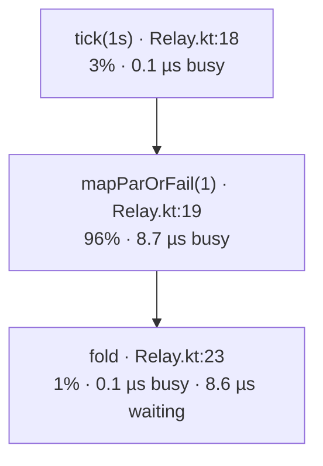

# 0050 — A number for every stage

## Problem

A slow pipeline has one slow stage, and nothing says which. lark's `Metrics`
(0034) is how a service counts things, and `lark-micrometer` backs it. A
pipeline reaches it only through a `wireTap` or a counter written into a `map`
body by hand, and neither can see time spent between stages.

Once 0046 lands, a backend compiles every stage, so a backend can wrap any
stage it chooses. Once 0049 lands, every stage has a stable name to tag a
number with.

## Not doing

- **No tracing.** One span per element costs more than most stage bodies.
  `lark-otel`'s spans stay at the handler and run level.
- **No always-on instrumentation.** A run is measured only when asked. An
  unmeasured run compiles exactly as it does today.
- **No per-element tags.** The tags are the stage and the pipeline, and
  nothing whose value set is unbounded.

## Shape

```kotlin
relay.start(PekkoStreams(system), measured = Measured(metrics, pipeline = "relay"))
```

For each stage, tagged `pipeline` and `stage` (the name and site from 0049):

| Metric | Kind | What |
|---|---|---|
| `lark.stream.elements` | counter | elements a stage has emitted |
| `lark.stream.busy` | histogram | time inside the stage body, per element |
| `lark.stream.waiting` | histogram | time a stage waited for downstream demand |

- A `Fused` stage (0047) is measured once for the whole segment, and each
  merged step is counted. A timer around every step would cost more than the
  merge saved.
- `waiting` is the number that names a bottleneck: the stage upstream of a slow
  one waits, and the slow one does not.
- `running.profile()` reads the same numbers back as a value, keyed by node, and
  0049's `render` draws them onto the diagram. Each stage gets its share of the
  run's busy time, its `busy` and `waiting` per element, and a colour from cool to
  hot by that share:

```kotlin
println(relay.render(Mermaid, profile = running.profile()))
```



- The same profile can come from a JMH run instead: `lark-stream-benchmarks`
  runs a benchmark's pipeline measured and writes the diagram beside its numbers,
  so a baseline says where its time went as well as how much there was.

## Why this shape

Wrapping at compile time needs no change to the pipeline. The alternative is a
`measured()` operator the user places, which is what `wireTap` already
approximates. Recommended against, because a user places it after the stage
they suspect, not the one that is slow.

## Stack

- [ ] **`spec-0050-counts`**: `Measured`, and `elements` and `busy` on both backends.
      Done when: a pipeline with one deliberately slow stage shows that stage's `busy`
      above every other.
- [ ] **`spec-0050-waiting`**: `waiting`.
      Done when: the stage upstream of the slow one has the highest `waiting`.
- [ ] **`spec-0050-diagram`**: `profile()`, `render(profile = …)`, and a profiled diagram per
      benchmark in `lark-stream-benchmarks`. Done when: the `mapPar` baseline's diagram
      marks `mapPar` hottest, and a golden file holds one rendering.

## Acceptance

```bash
./gradlew spotlessApply && ./gradlew build
```

## Open questions

1. **Is `busy` a histogram per element or a sampled timer?** Recommended:
   sample one element in 64 by default. A clock read per element costs about
   what 0047's merge saves.
2. **Profile shares: busy time only, or busy plus waiting?** Recommended:
   busy only. Waiting is a symptom of a neighbour, and colouring it would make
   the healthy stages beside a bottleneck look hot too.
3. **Does measuring disable 0047's merge?** Recommended: no. Measure the merged
   segment, and let `render(optimised = true)` say what a segment contains.

Decided while building `spec-0050-waiting` (2026-09-25), for editing: the
done-when for `waiting` was wrong, and the built one differs. After a stage
emits, it waits for about as long as everything downstream of it takes. So
*every* stage upstream of a slow one waits about as long as that stage's body,
and the source waits a little longest. The stage just before the slow one does
not wait longest. What names the bottleneck is where waiting drops: the slow
stage is the first, in the order data moves, whose waiting falls, because the
stages after it ask again at once. MeasuredTest holds that on both backends: the
stages upstream wait at least ten times as long as the slow stage and the one
after it. A run of fusable operators is watched by one probe after its last
step, so measuring still does not stop a run from fusing.

Decided while building `spec-0050-diagram` (2026-09-25), for editing: the
profile comes from a `Profiler`, a `Metrics` that keeps what a measured run
reports and passes it on, rather than from `running.profile()`. The `Running`
a backend answers with does not know the run was measured. A stage's share is
its sampled busy time over all stages', and its colour is taken from the
percentage printed, so a stage labelled 20% is never drawn cooler than the 20%
line. Question 2 went as recommended: busy only. The golden file uses a profile
with fixed numbers, because a measured one differs on every run.
